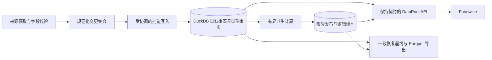

# 日线存储结构与增长风险专项评估

日期：2026-09-27。范围：aspool 日线存储、读取、写入及 Fundwise 消费链路。

状态：已完成代码检查、真实数据只读测试和隔离副本实验。未修改生产代码、迁移生产数据、执行补数或删除生产对象。

## 1. 整改判断

**应现在启动日线存储与访问层的专项结构重构。不能再把这项工作仅列为“以后慢了再考虑”的存储优化。**

原因已经不只是未来风险：现有布局对全市场近期查询存在明显固定开销，每次新增少量行情仍重写证券历史，多个业务模块直接依赖物理路径，分年兼容也未覆盖所有入口。随着年限、证券数、字段数和调用次数增加，这些成本会叠加。

重构边界限定为日线事实的存储、版本、查询和写入协调。继续使用现有采集协议、业务算法、DuckDB/Parquet 技术基础和 DataPool 公开契约；没有证据要求重写整个 Fundwise、引入分布式计算或将所有数据产品一并迁移。

**DG-03 完整候选验证后的修订：当前不批准迁移到全局 DuckDB 表或本次按月 Parquet 原型。** 全局表在 5× 完整 schema、主键/索引保留的正常整日单事务提交上触及既定 1 GB SQL 内存边界；按月原型虽通过完整字段与原子恢复核验，仍有单证券退化与整 catalog 复制成本（1× 同配置近期读取已通过建议目标）。继续保留现有已验证后端，具体完整负载、失败原样证据和后续门槛见 [DG-03 架构决策](architecture-decision.md)。

原早期窄布局实验的建议是规范化 DuckDB 日线事实表承担在线读写，日期事实和派生表通过确定版本关联，Parquet 用于可复现导出与恢复基线；该建议已被上述完整候选证据约束。 按月聚合 Parquet 是有竞争力的备选，尤其适合不可变历史分发；“热表 + 冷 Parquet + 修订覆盖层”应在更大规模或多进程持续读取需求支持时再采用，避免过早维护两套事实合并语义。

以下章节保留早期实测与判断背景；其中的微基准不能替代新 DG-03 完整候选结果。生产消费者接线与受控切换仍需后续验收，两个本次原型均未获准上线。

## 2. 方法与证据

生产池：`/home/ubuntu/.aspool`；实验副本位于 Linux `/tmp`，不是仓库所在的 Windows 挂载目录。
版本：本机 DuckDB 1.5.5、PyArrow 25.0.1。底层布局实验设置 2 线程、DuckDB 内存参数 512 MB；该参数不等于进程总 RSS 上限。

实验顺序执行，未并行竞争基准负载。各读取场景重复 3 次，报告中位数，没有清空操作系统缓存。布局查询复用连接；公开接口按其原实现创建连接并执行校验。结果不能作为冷启动、P95 或生产 SLA。

源数据只读，生成候选布局时使用现有共享池锁。测试前后日线文件路径、大小、mtime 指纹一致；没有对源文件逐字节重新哈希。未测网络、完整派生重算、备份恢复耗时和故障恢复。

证据与脚本：

- [布局结果](evidence/storage-layout/20260927/results.json)：元数据盘点、3 种布局的聚合查询及规模统计。
- [公开接口结果](evidence/storage-layout/20260927/public-results.json)：含校验、Pandas 返回和日期事实覆盖的真实接口。
- [增长实验](evidence/storage-layout/20260927/growth-results.json)：真实 `merge_daily` 在临时副本上的历史增长测试。
- [原布局查询 profile](evidence/storage-layout/20260927/raw_day_profile.json)：一天聚合报告读取 7,288 个文件。
- [布局脚本](evidence/storage-layout/20260927/assess.py)、[增长脚本](evidence/storage-layout/20260927/growth.py)、[接口脚本](evidence/storage-layout/20260927/public_read.py)。

## 3. 当前结构的实际特征

| 项目 | 本轮观测 |
|---|---:|
| 日线文件数，含 ETF | 7,288 |
| 总行数，含 ETF | 17,862,387 |
| 文件逻辑体积 | 1,513.87 MiB |
| 每文件行组数 | 全部为 1 |
| 单文件行数中位数 / 最大值 | 1,732 / 6,440 |
| Arrow schema 变体，不计 schema metadata | 27 |
| 文件页脚总大小 | 47.47 MiB |
| 按现有股票过滤口径得到的行数 | 16,349,620 |
| 2026-09-24 股票行数 | 5,570 |
| 将现存股票机械按证券×年拆分后的非空分区数 | 73,187，不含 ETF |

这说明问题同时存在于三个方向：证券维度布局偏向单证券历史查询；单行组跨多年不利于日期裁剪；schema 不统一使读取需要兼容性绑定。页脚体积只用于说明元数据规模，不等于每次查询实际磁盘读取字节数。

DuckDB 可以按列投影，并用行组统计跳过不匹配的行组；但一个证券的多年日期都落在同一组时，查询近期日期很容易与这一组的日期范围相交。SQL 中有日期过滤，不代表历史列块都能被跳过。官方文档也强调排序键和行组范围配合的重要性。[DuckDB Parquet Tips](https://duckdb.org/docs/current/data/parquet/tips)

因此，“Parquet 支持下推，所以有界日期读取已经解决 I/O 增长”这一推论不成立。本次 profile 显示一天原始聚合涉及 7,288 文件；其 `total_bytes_read=0` 不能解释成没有读取，profile 的扫描计数也不能直接当成唯一物理行数或设备 I/O。

## 4. 实测读取结果

### 4.1 当前完整公开接口

`read_research_daily` 请求 `symbol,date,close,pre_close,pct_chg,amount,is_st,turnover_rate`，结果包括既有数据校验、物化和日期事实覆盖。

| 请求 | 返回行数 | 中位耗时 |
|---|---:|---:|
| 全市场 2026-09-24 一天 | 5,570 | 7.664 秒 |
| 全市场 2026-07-27—09-24，60 个自然日 | 243,936 | 8.051 秒 |
| 000001.SZ 自 2000 年起的现存历史 | 6,318 | 0.337 秒 |

返回行数约相差 44 倍的一天与 60 天查询，耗时非常接近，支持“固定枚举、绑定、校验和文件扫描开销很重”的判断。尚未单独拆分每条校验 SQL 的耗时，不能把 7.664 秒全部归因于磁盘。

`pool.py:194` 的路径包含全目录枚举、schema 绑定、计数、重复键检查、数值检查、再次计数和最终查询；未设置 lookback 的这些实验调用会执行多条 SQL。校验本身有必要，但每次重复访问外部文件不是唯一实现方式。

### 4.2 隔离布局实验

将同一批股票的 9 个公共原始列规范化，构建按日期排序的 DuckDB 表和按年月聚合的 Parquet。原布局同样聚合股票的 count、close、amount、volume。三个场景是单日、60 自然日、五年；计数精确相同，浮点聚合在 `rel_tol=1e-10, abs_tol=1e-6` 内一致。

| 原始聚合查询 | 原证券 Parquet | 年月聚合 Parquet | 日期排序 DuckDB 表 |
|---|---:|---:|---:|
| 全市场一天 | 1.198 秒 | 0.0174 秒 | 0.000835 秒 |
| 全市场 60 个自然日 | 1.214 秒 | 0.0223 秒 | 0.00124 秒 |
| 全市场五年 | 1.199 秒 | 0.102 秒 | 0.0165 秒 |

年月候选产生 365 个物理文件，部分月份因并行写入有多个文件。初次 schema/关系绑定：原布局约 1.54 秒，年月候选约 0.014 秒；表内查询不需要绑定数千个外部文件。

必须正确解读：

- 这是规范化 schema、预先排除 ETF、重新组织布局的组合效果，未独立隔离每个因素。
- 表格排除初次绑定时间；原布局和候选都执行聚合，没有包含完整业务接口的校验、事实覆盖、传输或 Pandas 返回。
- 候选只有 9 列，不能把其约 300 MiB 体积与现有宽表的约 1.5 GiB 对比后宣称节省了同等存储。
- 聚合相等不足以验收迁移，尚未核验所有键与全部字段逐项相等。
- 毫秒级热缓存数据不能直接承诺迁移后完整接口达到该速度。

**反向负载也有明确代价。** 对 000001.SZ 直接定位原单文件，原始聚合中位约 0.00109 秒；日期排序 DuckDB 表约 0.0434 秒，年月 Parquet 约 0.262 秒。原布局在单证券历史读取上确有优势。原布局若先绑定全池再筛单证券，则约 0.399 秒；不能用这一较慢路径替代直接文件定位来美化候选优势。

结论是应该按真实负载重构，并补齐候选的证券访问路径。全市场优势不能自动证明所有消费者都受益。DuckDB 的排序统计、索引及其维护成本也需按实际查询验证，不能简单承诺“加个索引就解决”。[DuckDB 索引与排序](https://duckdb.org/docs/current/guides/performance/indexing)

## 5. 写入放大及未来增长

### 5.1 实际合并函数的增长实验

按历史长度分层选择 64 个证券，保留其完整物理 schema。通过不重叠的交易日期平移构造 1 倍、2 倍、5 倍历史，每轮各追加一条，调用真实 `merge_daily`。不连接生产目录库，不执行网络抓取和限价派生。每个倍率 3 轮。

| 历史倍率 | 每轮真实变化 | 重写行数/变化行数，中位 | 输出文件总体积，中位 | 合并耗时，中位 |
|---|---:|---:|---:|---:|
| 1× | 64 条 | 2,930× | 16.44 MiB | 0.493 秒 |
| 2× | 64 条 | 5,858× | 20.56 MiB | 0.634 秒 |
| 5× | 64 条 | 14,642× | 30.81 MiB | 1.187 秒 |

同样执行无变化重跑，变化条数均为 0，但耗时由 0.195 秒增长到 0.312、0.667 秒。跳过写入已有效，判断无变化仍需读取和检查历史。

复制的数值重复度很高，压缩后字节不会随倍率等比例增长；这不是未来行情压缩率预测。时间不包含副本准备，也不包括覆盖表、stale、同步持久化和派生发布。输出文件大小是重写文件量，不是测得的块设备落盘量。

当前截至最新日的股票文件合计约 1.402 GiB。假设它们每天均新增一条且执行一轮现有合并，按现有文件规模静态估算，243 轮约重写 341 GiB/年；未来文件变大或一日多轮会增加此量。这不是本轮实测年 I/O，也不是已出现磁盘寿命问题的判断。

### 5.2 会不会“雪球式增长”

需要分开容量与工作量。

固定活跃证券数 N、平均历史长度 H、每天变化天数 w 时，当前整文件合并的工作量与 `N×H` 相关；业务新增规模约为 `N×w`。H 随时间增长，历史越长，追加同样一天的维护越贵。长时间累计重写量包含二次增长项；这不意味着某一次更新耗时会指数增长。

证券数增长会同时增加文件数和总行数；字段数增长会增加宽文件重写与 schema 兼容成本；调用次数增长会反复支付文件枚举和查询校验开销。继续按证券×年拆分，文件数则接近 `N×年数`，本池现有股票就会产生 73,187 个非空分区。

但容量不应夸大：2025 年现存股票记录约 130.9 万条，当前股票总历史约 1,635 万条。固定 5,570 个证券、每年 243 个会话的静态情景，每年新增约 135 万行，十年约新增 1,354 万行。未计新证券、更多字段和新数据频率；这不是市场预测，也不是未来五年突然增长五倍。

因此，当前应整改的主要理由是**每次增量操作的成本不受增量范围约束，以及逻辑越来越依赖目录布局**。容量短期仍在单机可处理范围，不支持以“即将爆炸”为理由全面平台化。

## 6. 已确认的结构耦合

| 位置 | 当前行为 | 重构要求 |
|---|---|---|
| `daily_storage.py:153` | 有变化与无变化都先读证券文件；有变化重写整个文件 | 写入以键和变更集合为边界 |
| `daily_storage.py:136` | 分年更新后通过 `read_daily_table` 读回全部分区以刷新 coverage | 覆盖元数据增量维护，避免分区后仍全历史读取 |
| `pool.py:225` | 请求单证券也先枚举全池，再缩小文件集合 | 统一范围定位入口，禁止业务层遍历目录定位数据 |
| `pool.py:353` | `status()` 只匹配旧式 `symbol=*/bars.parquet` | 分年迁移并非所有入口已经支持，状态不能漏报新布局 |
| `limit_events.py:289` | 按证券加载历史，再组合日期事实 | 存储读取明确列、时间范围与前置状态 |
| `limit_events.py:1234` 附近 | 为重算构建市场轴而遍历日线日期 | 以受治理日历及明确补充规则提供会话，不反复从全池恢复日历 |
| `limit_amount.py:157` | 消费逻辑理解证券目录和 `year=` 分区 | 通过统一存储访问方法取事件键对应金额 |
| Fundwise `freshness.py:25` | 全池文件指纹参与 revision | 使用公开逻辑修订，物理布局变化不应强迫业务缓存失效 |

这些耦合说明不能只换目录、改一处 writer 就宣布完成迁移。继续新增布局分支会提高未来每次改动的成本。专项重构应建立少量明确的存储操作，不需要设计可插拔“大而全”框架。

已有值得保留的基础：`pool_lock` 提供跨进程读写协调，网络获取已移出写入锁；限价单日发布已有数据库事务。问题是文件批量重写会延长写入阶段，而且数据库与外部文件不能靠同一数据库事务共同回滚。不能将当前系统描述成完全没有锁或原子发布。

## 7. 候选架构比较与建议

| 方案 | 近期市场查询 | 增量写入 | 主要风险 | 判断 |
|---|---|---|---|---|
| 原结构加文件清单、读取复用、较小行组 | 能改善 | 仍需重写证券文件 | 长期写入边界不变，多年字段维护继续放大 | 可作过渡，不是最终整改完成 |
| 全部证券按年/月再拆 | 日期裁剪可能改善 | 重写较小分区 | 大量小文件；现有更新后全历史读取与入口兼容仍需改 | 不作为默认迁移目标 |
| 规范化 DuckDB 日线表 | 实测最有潜力 | 批量插入/修订，避免应用整文件重写 | 主键/索引成本、物理排序退化、进程锁、数据库恢复 | 首选验证和实施方向 |
| 按年月聚合 Parquet | 实测明显改善 | 当前月可重写；修订旧月需重写受影响文件 | 单证券读取、发布清单和跨文件原子性 | 主要备选；不宜按证券再交叉过细分区 |
| 热事务表 + 冷 Parquet + 修订覆盖 | 可把常规成本限制在热点 | 适合少量迟到修订 | 合并、删除、压实、去重、跨层恢复和快照的复杂度 | 有规模/并发证据后再采用 |

首选方向的逻辑结构：

首阶段保持原有进程协调约束。原生 DuckDB 文件的一个进程写入、多进程只读模式不能被误解为多个应用进程可随意并发读写同一文件；若需要写入期间其他进程持续读取，需专门选定服务化读取或不可变发布快照方案。[DuckDB 并发文档](https://duckdb.org/docs/current/connect/concurrency)

“数据库内更新”也不等于每次物理只写一条：WAL、检查点、压缩和索引仍有成本。应测量连续多个更新周期和历史修订后的表现。冷热分层的收益亦伴随维护协议成本；DuckLake 的小变更内联机制提供了成熟设计参考，但这次没有安装或测试 DuckLake，不能据此宣称它优于现有候选。[DuckLake Data Inlining](https://ducklake.select/docs/stable/duckdb/advanced_features/data_inlining)

## 8. 如何实施，才能避免重构本身制造新风险

1. **现在列为存储整改主线。** 统一日线读写边界、键/类型/单位、日期事实来源与逻辑修订。先消除业务代码遍历目录的依赖；保留旧后端用于验证与回退。
2. **在独立候选库迁入完整 schema。** 不复制本轮 9 列实验表直接上线。所有 Fundwise 所需字段、ETF、其他消费者和日期事实覆盖都要纳入；来源扩展字段必须有明确保存或退役决定。
3. **用同一输入运行两套后端并核对。** 候选仅接收可重放的同一变更集合，不建立两个独立权威写入入口。比较全部键/字段、空值、单位、派生结果与公开接口行为。
4. **验证增长与长期维护。** 继续覆盖 1×/2×/5× 历史、更多证券、重复刷新、旧日修订、删除、跨年、批量回补、连续多日后排序/索引成本；测完整 API、提交、锁等待、临时磁盘和恢复。
5. **分阶段切换消费者。** 先将候选用于影子核对，再切读写权威。切换后旧库是限定保留期的恢复对象，不继续独立更新；如果需要回退，明确冻结写入或重放切换后的变更，不能回到过期旧池继续服务。

建议验收条件，而非已测达标值：

- 完整公开接口及派生语义与参考一致；原 P0 五年读取 RSS ≤ 2 GiB 验收继续执行。
- 日常更新不枚举、解码或重写全部冷历史；无变化批次不变更业务 revision。
- 固定热点、固定证券数下扩大历史，解释并测量查询、提交、校验和元数据成本；允许树索引等必要增长，拒绝隐式全历史工作。
- 在当前硬件上把单日/近期完整公开读取的热缓存中位目标先设为 1 秒以内，至少较现状有实质改善；该目标需完整原型验证，不能从底层 0.001 秒推导已经可达。P95 与冷启动目标需补充重复采样后确定。
- 单证券长历史性能不得因市场查询优化而未经评估地退化；以真实消费者负载和既定延迟预算裁决，不能只比较某一条聚合。
- 校验候选的唯一键、索引、批量修订和检查点成本；不以未建约束的实验表作为最终性能成绩。
- 失败后能判定有效发布范围，恢复基线经过独立还原与读取验证；迁移、回退和后续清理均有可执行步骤。

## 9. 对此前建议的修订

此前“文件很小，暂不普遍拆分”的判断仍成立，73,187 个证券年分区说明机械拆分会带来新的管理负担。

需要上调的是整改优先级：不能因为总量只有约 4 GiB，就把存储结构评估长期推迟。本次已测得当前访问模式与布局不匹配，且写入工作量依赖全部历史，足以启动专项重构。

保留采集、算法与 API 契约，重构日线事实的存储和访问方式；用完整原型验收决定具体迁移，而不是等到数据增长造成服务不可用才开始处理。

任务拆分、依赖、切换与回退门槛见 [数据整治落地推进方案](data_remediation_execution_plan.md)；本评估与隔离实验不替代完整候选验收。
